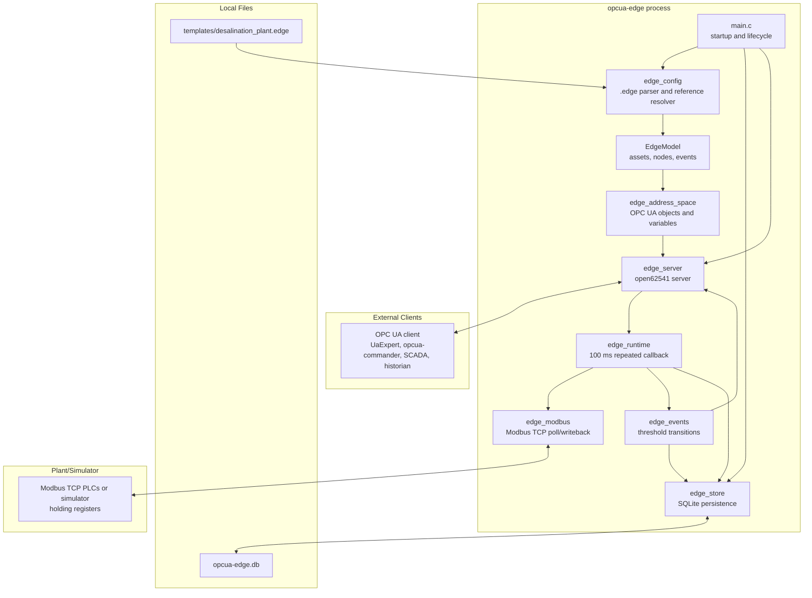

# opcua-edge

`opcua-edge` is a plain-C OPC UA edge server for industrial telemetry. It loads a plant model from a `.edge` template, exposes the model as an OPC UA address space, polls live values from Modbus TCP, accepts OPC UA writes for command nodes, evaluates threshold events, and persists configuration, latest values, event history, and benchmark runs to SQLite.

The default repository template models the **XYZ Desalination Plant**, a 200 MGD seawater reverse osmosis facility with intake, pretreatment, high-pressure pumping, RO, post-treatment, distribution, and utilities areas.

## Features

- OPC UA server built on `open62541` v1.5.4.
- Deterministic startup from a line-oriented `.edge` plant template.
- Modbus TCP polling for holding-register-backed process values.
- OPC UA writeback for writable command/setpoint nodes.
- Threshold event detection with SQLite history and OPC UA BaseEvent notifications.
- SQLite state persistence for model metadata and latest values.
- Docker, systemd, and direct-binary deployment paths.
- CTest coverage for parser, value conversion, address space, events, store, benchmarks, and Modbus simulator integration.
- Synthetic benchmark tool for read, write, and event throughput.

## Architecture



## Runtime Flow

1. `main.c` reads configuration from defaults, environment variables, and optional `argv[1]`.
2. `edge_config_load` parses the `.edge` template into fixed-size arrays for assets, nodes, and events.
3. `edge_config_wire_runtime` resolves indexes into runtime pointers after validation.
4. `edge_store` opens SQLite, creates or migrates schema version 2, persists the model, and restores latest values.
5. `edge_server` starts an `open62541` server on the configured OPC UA port.
6. `edge_address_space` adds one plant object, asset objects, and callback variable nodes.
7. `edge_runtime` registers a 100 ms repeated callback in the OPC UA server loop.
8. Each tick drains pending OPC UA writes to Modbus, polls all Modbus-backed nodes, evaluates events, and persists latest values every 50 ticks.
9. On `SIGINT` or `SIGTERM`, the process persists latest values, disconnects Modbus, deletes the OPC UA server, and closes SQLite.

## OPC UA Model

The server creates namespace `urn:twinedge:opcua-edge`.

Node identifiers are stable strings:

| Item | NodeId pattern | Example |
| --- | --- | --- |
| Plant object | `plant:<plant_id>` | `plant:xyz_desalination` |
| Asset object | `asset:<asset_id>` | `asset:hp_pump_1` |
| Variable node | `node:<asset_id>.<node_id>` | `node:hp_pump_1.vibration` |

Asset objects are organized below the plant or parent asset. Variable nodes are added with `HasComponent` references. Values are served through open62541 callback value sources, so OPC UA reads return the current `EdgeNode` value and OPC UA writes update the in-memory node immediately before Modbus writeback on the next runtime tick.

Writable nodes expose OPC UA read/write access and are intended for commands and setpoints, such as pump start commands, backwash requests, and chemical dose rates. Read-only nodes expose process telemetry.

## OPC UA Client Usage

Any OPC UA client can connect to:

```text
opc.tcp://127.0.0.1:4840
```

For terminal browsing during development:

```sh
sudo apt install nodejs npm
./scripts/opcua-console.sh
```

To connect to another endpoint:

```sh
./scripts/opcua-console.sh opc.tcp://127.0.0.1:14840
```

The script runs `opcua-commander` through `npx`; no OPC UA client implementation is vendored into the edge runtime.

## Default XYZ Plant

`templates/desalination_plant.edge` defines:

| Count | Value |
| --- | ---: |
| Assets | 33 |
| OPC UA variable nodes | 116 |
| Read-only nodes | 98 |
| Writable nodes | 18 |
| Event definitions | 21 |
| Modbus units | 1 through 7 |

Asset type distribution:

| Type | Count |
| --- | ---: |
| `area` | 7 |
| `pump` | 5 |
| `filter` | 3 |
| `hp_pump` | 3 |
| `ro_train` | 3 |
| `tank` | 3 |
| `dosing_skid` | 3 |
| `basin`, `daf`, `erd_skid`, `meter`, `outfall`, `screen` | 1 each |

The top-level process areas are seawater intake, pre-treatment, high-pressure pumping, reverse osmosis, post-treatment, storage and distribution, and utilities and chemicals.

Representative nodes include:

| Area | Assets | Example nodes |
| --- | --- | --- |
| Intake | intake basin, band screen, intake pumps | tide level, raw conductivity, screen differential pressure, pump flow, command start |
| Pretreatment | coagulation tank, DAF, cartridge filters | turbidity, coagulant dose, filter differential pressure, backwash request |
| High pressure pumping | HP pumps, booster pump | suction/discharge pressure, motor current, vibration, speed RPM, command start/stop |
| Reverse osmosis | RO trains, energy recovery skid | feed pressure, permeate conductivity, recovery percent, differential pressure, isobaric efficiency |
| Post-treatment | clearwell, chlorination skid | level percent, pH, chlorine residual, dose rate |
| Distribution | product tank, distribution pumps | tank level, outlet pressure, flow, command start |
| Utilities | antiscalant, sodium hypochlorite, power meter, brine outfall | chemical tank levels, dose rates, kWh/m3, outfall conductivity |

Default events cover high vibration, high bearing temperature, low suction pressure, overload current, RO permeate TDS drift, low RO recovery, high cartridge filter differential pressure, low clearwell level, and low chlorine residual.

## Template Format

The `.edge` file is an INI-like format with repeated sections:

```ini
[plant]
id=xyz_desalination
name=XYZ Desalination Plant

[asset]
id=hp_pump_1
type=hp_pump
name=High Pressure Pump 1
parent=hp_pumping

[node]
asset=hp_pump_1
id=vibration
name=Vibration
data_type=double
access=read
source=modbus
modbus_unit=3
modbus_register=40006
scale=0.01

[event]
asset=hp_pump_1
id=high_vibration_hp1
source_node=vibration
condition=greater_than
threshold=8.5
severity=700
```

Supported data types are `bool`, `int16`, `int32`, `uint32`, and `double`. Supported access modes are `read` and `read_write`. Event conditions are `greater_than` and `less_than`.

Parent assets must be declared before children. The loader validates required fields, duplicate assets, duplicate nodes within an asset, duplicate events, parent cycles, node asset references, and event source references.

## Modbus Mapping

The runtime uses Modbus TCP holding registers. Template address `40001` maps to Modbus offset `0`.

| Edge type | Register width | Encoding |
| --- | ---: | --- |
| `bool` | 1 | bit 0 of one holding register |
| `int16` | 1 | signed 16-bit register |
| `int32` | 2 | high word first, then low word |
| `uint32` | 2 | high word first, then low word |
| `double` | 1 | signed int16 raw value multiplied by `scale` |

For `double` writeback, the engineering value is divided by `scale`, rounded, narrowed to signed 16-bit, and written to one holding register. A zero scale is treated as `1.0`.

Connection failures use exponential reconnect backoff from 0.5 seconds up to 30 seconds. An empty `EDGE_MODBUS_HOST` or `EDGE_MODBUS_PORT=0` disables Modbus while keeping the OPC UA server available.

## Persistence

SQLite stores:

| Table | Purpose |
| --- | --- |
| `plants` | Current plant identity |
| `assets` | Asset hierarchy snapshot |
| `nodes` | Node metadata and Modbus mapping |
| `event_definitions` | Event configuration snapshot |
| `event_history` | Fired event transitions |
| `latest_values` | Last persisted node values |
| `benchmark_runs` | Optional persisted benchmark results |

The binary manages schema version `PRAGMA user_version = 2`. It migrates version 1 benchmark columns automatically and refuses to start against newer or unsupported old versions.

Use SQLite backup APIs for hot backups:

```sh
sqlite3 opcua-edge.db ".backup backup.sqlite"
```

## Build

Dependencies:

- CMake 3.20 or newer
- C11 compiler
- `libsqlite3-dev`
- `libmodbus-dev`
- `pkg-config`
- Git, for the `open62541` submodule

Ubuntu/Debian:

```sh
sudo apt install build-essential cmake git libsqlite3-dev libmodbus-dev pkg-config
git submodule update --init --recursive
cmake -S . -B build -DCMAKE_BUILD_TYPE=Release
cmake --build build -j
ctest --test-dir build --output-on-failure
```

Raspberry Pi OS 64-bit:

```sh
sudo apt update
sudo apt install build-essential cmake git libsqlite3-dev libmodbus-dev pkg-config
git submodule update --init --recursive
cmake -S . -B build -DCMAKE_BUILD_TYPE=Release
cmake --build build -j "$(nproc)"
ctest --test-dir build --output-on-failure
```

Convenience script:

```sh
bash scripts/build.sh
```

Sanitizer and leak-check gates:

```sh
bash scripts/asan.sh
bash scripts/leak-check.sh
```

`scripts/leak-check.sh` requires Valgrind.

## Local Run

```sh
EDGE_CONFIG_PATH=templates/desalination_plant.edge \
EDGE_DB_PATH=opcua-edge.db \
EDGE_MODBUS_HOST=127.0.0.1 \
EDGE_MODBUS_PORT=1502 \
EDGE_OPCUA_PORT=4840 \
./build/opcua-edge
```

`argv[1]` overrides `EDGE_CONFIG_PATH`:

```sh
./build/opcua-edge templates/desalination_plant.edge
```

## Modbus Simulator

Development and tests use the Python simulator in `tools/modbus_sim/`. It is not shipped in the runtime image.

```sh
python3 -m pip install -r tools/modbus_sim/requirements.txt
python3 tools/modbus_sim/modbus_sim.py \
  --template templates/desalination_plant.edge \
  --host 127.0.0.1 \
  --port 1502 \
  --profile normal \
  --tick-ms 100
```

Profiles:

```text
normal
high_vibration
low_suction_pressure
overload_current
ro_quality_drift
```

Inspect the generated register map:

```sh
python3 tools/modbus_sim/modbus_sim.py \
  --template templates/desalination_plant.edge \
  --dump-map
```

## Configuration

| Variable | Default | Purpose |
| --- | --- | --- |
| `EDGE_CONFIG_PATH` | `templates/desalination_plant.edge` | Template path. Overridden by `argv[1]`. |
| `EDGE_DB_PATH` | `opcua-edge.db` | SQLite database path. |
| `EDGE_OPCUA_PORT` | `4840` | OPC UA server TCP port. |
| `EDGE_MODBUS_HOST` | `127.0.0.1` | Modbus TCP host. Empty string disables Modbus. |
| `EDGE_MODBUS_PORT` | `1502` | Modbus TCP port. `0` disables Modbus. |
| `EDGE_DATA_DIR` | `/data` in Docker | Container data root used by entrypoint. |
| `EDGE_DEFAULT_TEMPLATE` | `desalination_plant.edge` in Docker | Template seeded into `/data/templates` on first container start. |

## Security Notes

The default server configuration is intended for local development, lab use, and controlled industrial networks. It does not currently configure OPC UA application certificates, encrypted security policies, or user authentication. Do not expose port 4840 or Modbus port 502/1502 directly to the public Internet. Use network segmentation, firewall rules, VPN/private connectivity, or an authenticated gateway for production deployments.

## Docker

Build:

```sh
docker build -f packaging/Dockerfile -t opcua-edge:latest .
```

Run:

```sh
docker volume create edge-data
docker run -d \
  --name opcua-edge \
  --restart unless-stopped \
  -p 4840:4840 \
  -v edge-data:/data \
  -e EDGE_MODBUS_HOST=plc.host \
  opcua-edge:latest
```

The image builds on Debian Bookworm, copies only the runtime binary, templates, and entrypoint into the final image, runs as UID/GID `10001`, exposes port `4840`, and uses `nc` for a TCP healthcheck. The entrypoint seeds the default template into `/data/templates` only if it is missing. The database is stored at `/data/db/opcua-edge.db`.

## systemd Deployment

```sh
cmake -S . -B build -DCMAKE_BUILD_TYPE=Release
cmake --build build -j
sudo cmake --install build --prefix /usr/local

sudo useradd -r -s /usr/sbin/nologin opcua-edge
sudo install -d -o opcua-edge -g opcua-edge /etc/opcua-edge /var/lib/opcua-edge
sudo install -m 0644 -o opcua-edge -g opcua-edge \
  /usr/local/share/opcua-edge/templates/desalination_plant.edge \
  /etc/opcua-edge/desalination_plant.edge

sudo cp /usr/local/lib/systemd/system/opcua-edge.service /etc/systemd/system/
sudo systemctl daemon-reload
sudo systemctl enable --now opcua-edge
journalctl -u opcua-edge -f
```

The installed service uses `/etc/opcua-edge/desalination_plant.edge` and `/var/lib/opcua-edge/opcua-edge.db`.

## Benchmarks

The benchmark tool creates synthetic pump models and exercises the OPC UA server in-process through open62541 APIs. A synthetic pump has 11 tags, including 2 writable command tags. With events enabled, each pump has 4 event definitions.

Benchmarks are intended for relative comparison across hardware, compiler settings, and releases. The Raspberry Pi 5 results are included as the primary edge-device baseline. The current Azure VM results are included as a server-class reference baseline for development and scaling comparison.

### Edge Device Baseline

These results were collected on a Raspberry Pi 5 8 GB with active cooling and a `Release` build.

Commands used:

```sh
mkdir -p benchmarks/raspi-8gb
./build/edge-benchmark --scenario read --pumps 100 --seconds 30 --csv-dir benchmarks/raspi-8gb
./build/edge-benchmark --scenario write --pumps 100 --seconds 30 --csv-dir benchmarks/raspi-8gb
./build/edge-benchmark --scenario events --pumps 100 --seconds 30 --with-events --csv-dir benchmarks/raspi-8gb
```

System information:

| Item | Value |
| --- | --- |
| Device | Raspberry Pi 5 Model B Rev 1.1 |
| Kernel | Linux 6.12.75+rpt-rpi-2712 aarch64 |
| OS base | Debian 1:6.12.75-1+rpt1 |
| Memory | 7.9 GiB total, 6.6 GiB available during capture |
| Swap | 2.0 GiB total, 0 B used during capture |
| Temperature | 47.2 C |
| Throttling | `0x0` |

Results:

| Scenario | Model | Throughput | Avg latency | p95 | p99 | CPU avg | Peak RSS | Errors |
| --- | --- | ---: | ---: | ---: | ---: | ---: | ---: | ---: |
| Read | 100 assets, 1,100 tags | 3,395,590 reads/sec | 314 us/pass | 318 us | 322 us | 99.97% | 26,336 KB | 0 |
| Write | 100 assets, 1,100 tags, 200 writable | 3,870,794 writes/sec | 43 us/pass | 44 us | 47 us | 100.00% | 26,352 KB | 0 |
| Events | 100 assets, 1,100 tags, 400 events | 82,757 events/sec | 2,402 us/pass | 4,813 us | 4,900 us | 99.96% | 148,672 KB | 0 |

### Server Reference Baseline

These results were collected on a server-class Azure VM. They are useful as a reference point, but they should not be interpreted as edge-device throughput.

Commands used:

```sh
./build/edge-benchmark --scenario read --pumps 100 --seconds 5 --csv-dir benchmarks/baselines
./build/edge-benchmark --scenario write --pumps 100 --seconds 5 --csv-dir benchmarks/baselines
./build/edge-benchmark --scenario events --pumps 100 --seconds 5 --with-events --csv-dir benchmarks/baselines
```

Host:

| Item | Value |
| --- | --- |
| Date | 2026-05-05 |
| OS | Ubuntu 24.04 on Azure, Linux 6.17.0-1011-azure |
| CPU | 16 vCPU Intel Xeon Platinum 8370C @ 2.80 GHz |
| Memory | 62 GiB |
| Build | `Release` |

Results:

| Scenario | Model | Throughput | Avg latency | p95 | p99 | CPU avg | Peak RSS | Errors |
| --- | --- | ---: | ---: | ---: | ---: | ---: | ---: | ---: |
| Read | 100 assets, 1,100 tags | 4,461,698 reads/sec | 237 us/pass | 247 us | 268 us | 100.00% | 26,580 KB | 0 |
| Write | 100 assets, 1,100 tags, 200 writable | 5,986,466 writes/sec | 26 us/pass | 31 us | 34 us | 99.80% | 26,880 KB | 0 |
| Events | 100 assets, 1,100 tags, 400 events | 138,760 events/sec | 1,429 us/pass | 2,882 us | 2,912 us | 99.97% | 62,300 KB | 0 |

Latency is measured per full scenario pass: all tags for reads, all writable tags for writes, and one complete event evaluation pass for events.

## Test Status

Last local validation:

```text
cmake -S . -B build -DCMAKE_BUILD_TYPE=Release
cmake --build build -j
ctest --test-dir build --output-on-failure
```

Result:

```text
100% tests passed, 0 tests failed out of 7
Total Test time (real) = 2.37 sec
```

## Code Organization

| Path | Purpose |
| --- | --- |
| `src/main.c` | Production process entrypoint and shutdown path |
| `src/edge_config.c` | Template parser, validation, and runtime wiring |
| `src/edge_address_space.c` | OPC UA address-space construction |
| `src/edge_server.c` | open62541 server lifecycle |
| `src/edge_runtime.c` | Periodic tick orchestration |
| `src/edge_modbus.c` | Modbus TCP polling and writeback |
| `src/edge_events.c` | Threshold event evaluation and OPC UA event emission |
| `src/edge_store.c` | SQLite schema and persistence |
| `src/edge_time.c` | Millisecond timestamp helper |
| `include/` | Public project headers |
| `benchmarks/` | Synthetic benchmark model, scenarios, and reporting |
| `tests/` | Unit and integration tests |
| `tools/modbus_sim/` | Development Modbus TCP simulator |
| `packaging/` | Docker, entrypoint, and systemd files |
| `db/schema.sql` | Human-readable schema mirror |

## Design Decisions

- C11 and fixed-size model arrays keep the runtime small, portable, and predictable for edge deployments.
- `open62541` is vendored as a submodule so the OPC UA stack version is controlled with the application.
- Namespace zero is built in reduced mode to lower footprint while keeping server, subscriptions, methods, JSON/XML encoding, and event subscriptions enabled.
- The `.edge` format is intentionally strict and line-oriented so invalid plant models fail fast at startup.
- Template parsing stores indexes first, then wires pointers after validation. This avoids dangling pointers while arrays are being filled.
- OPC UA variable nodes use callback value sources instead of mirrored UA storage, keeping the server value synchronized with `EdgeNode`.
- OPC UA writes are accepted into memory first and written to Modbus on the runtime tick. This keeps OPC UA callbacks short and centralizes PLC I/O handling.
- SQLite is embedded directly in the process for local durability without requiring a separate database service.
- Event definitions emit BaseEvent-style notifications from asset nodes. Custom OPC UA event types can be added later if clients require browsable event type metadata.
- Docker persists only `/data`, so image upgrades do not overwrite operator-edited templates or the SQLite database.

## Repository Notes

The project currently includes `external/open62541` as a Git submodule. If a project-owned fork is selected later, update `.gitmodules`, run `git submodule sync`, update the submodule SHA, and rerun the full test suite.

## Attribution

This repository was developed with assistance from Codex.

## License and Security

`opcua-edge` is licensed under the Apache License 2.0. See `LICENSE`.

This repository includes `open62541` as a Git submodule under its own Mozilla Public License 2.0 terms. See `NOTICE` and `external/open62541/LICENSE`.

Please report suspected security vulnerabilities privately. See `SECURITY.md`.
